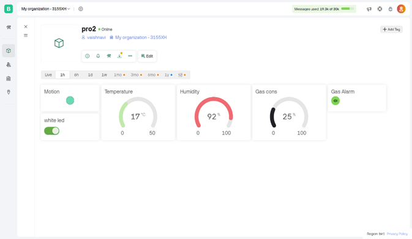
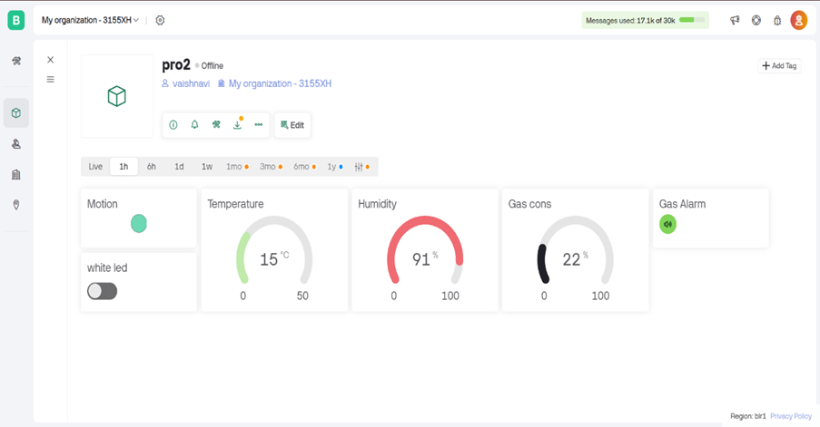

# 🏠 Home Automation Dashboard

This project is a **static HTML-based dashboard** that simulates a smart home control interface. It allows users to visualize the status of devices and sensors in a home environment and represents how basic automation systems work. Ideal for demonstration, educational use, or prototyping UI concepts.

## 🌐 Live Demo
Access the live version here:  
👉 [GitHub Pages Link](https://anditisyou.github.io/Home-Automation/)

## 📸 Screenshots
| Dashboard (On) | Dashboard (Off) |
|----------------|-----------------|
|  |  |

## 🛠️ Features
- Clean and interactive HTML dashboard
- Toggle states for smart devices
- Sensor status mockup visuals
- System architecture image
- Light/dark states for simulation
- Fully client-side (no backend)

## 📂 Project Structure
```

Home-Automation/
│
├── index.html              # Main dashboard UI
├── report.html             # Project report page
├── dash\_on.jpg             # Dashboard ON state image
├── dash\_off.jpg            # Dashboard OFF state image
├── system-architecture.jpg # Visual of system design
├── sensors.jpg             # Sensor layout image
├── docs/                   # Additional documentation (if any)
└── README.md               # Project readme

````

## 📡 Future Enhancements
- Backend integration with real sensors (via NodeMCU, Raspberry Pi, etc.)
- MQTT/WebSocket-based live updates
- Authentication and role-based access
- Responsive mobile-first layout

## 🚀 How to Use
1. Clone the repo:
   ```bash
   git clone https://github.com/anditisyou/Home-Automation.git
````

2. Open `index.html` in your browser.
3. Click on toggles to simulate device control.

> ⚠️ This project is **front-end only** and does not currently connect to any physical devices.

## 📘 License

This project is open-source under the [MIT License](LICENSE).

---

```

Let me know if you want to add a **report section**, credits, or GitHub stats badges.
```
